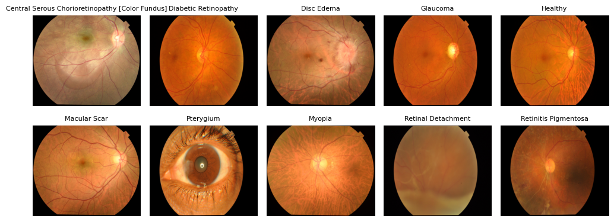
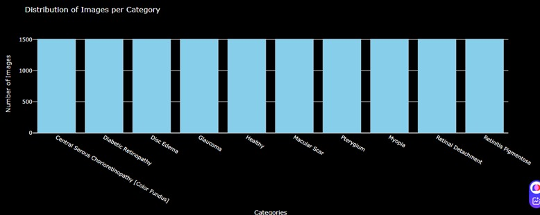

# Eye Diseases Classification 👁️
## Introduction
Eye diseases are a leading cause of visual impairment and blindness worldwide, affecting millions of individuals and significantly impacting quality of life. Conditions such as diabetic retinopathy, glaucoma, age-related macular degeneration, and cataracts often develop gradually and may go unnoticed until irreversible damage has occurred. Early and accurate diagnosis is therefore essential for timely treatment and vision preservation. This project focuses on developing a system for eye disease classification, aiming to support ophthalmologists in identifying and differentiating between common eye conditions more efficiently and accurately. By leveraging image processing and machine learning techniques, the project seeks to contribute to the early detection and prevention of blindness.

## Problem Statement
Despite the critical importance of early diagnosis, many eye diseases remain undetected until they reach advanced stages, often leading to irreversible vision loss or blindness. There is a growing need for an automated, reliable, and efficient system that can assist in the early detection and classification of common eye diseases. This project aims to address this gap by developing a machine learning-based solution capable of accurately classifying eye diseases from retinal images.

## Dataset
The dataset has 10 clasess: Diabetic Retinopathy, Glaucoma, Macular Scar, Optic Disc Edema, Central Serous Chorioretinopathy (CSCR), Retinal Detachment, Retinitis Pigmentosa, Myopia,Pterygium , and Healthy. The total of images 5335  were collected from Anwara Hamida Eye Hospital in Faridpur and BNS Zahrul Haque Eye Hospital in Faridpur district with the help of the hospital authorities. Then from these original images, a total of 15090 augmented images are produced by using brightness to adjusts the brightness of the input image to increase the number of data to make the dataset balance. The dataset can be downloaded here: https://data.mendeley.com/datasets/s9bfhswzjb/1
### Example 

 
### Dataset after Augmentation:

## Model
This project aims to classify 10 types of eye diseases using a convolutional neural network based on VGG16, a pre-trained model. Leveraging transfer learning, the model reuses the powerful feature extraction capabilities of VGG16 while fine-tuning its deeper layers to adapt to the specific task of retinal image classification.
The model takes an input image of size (224, 224, 3), which aligns with the expected input shape of VGG16. The dataset consists of 12,075 training images and 3,010 validation images, ensuring a robust foundation for model learning and evaluation. To enhance performance and generalization, the training data is augmented with transformations such as rotation, zoom, and shifting. 
The original classification head of VGG16 is replaced with custom dense layers to suit the 10-class output. Only the last block (block5) of VGG16 is unfrozen and trained, while the rest of the network remains frozen to preserve learned features.
The model is trained using the Adam optimizer and categorical cross-entropy loss, with performance evaluated through accuracy. 

## Results
The model was trained for a total of 20 epochs, and the results at epoch 20 demonstrated the best overall performance and balance between learning and generalization:

Training Accuracy: 95.8%

Validation Accuracy: 86.35%

Validation Loss: 0.6657

At epoch 20, the model reached its highest validation accuracy and one of the lowest validation losses across the entire training process. This suggests that the model not only learned the training data effectively but also generalized well to unseen validation data a critical indicator of model robustness.

Training Accuracy: 

Achieving a training accuracy of 95.8% means that the model was able to correctly classify the vast majority of the training images. This high accuracy reflects the model's ability to learn intricate patterns and features relevant to the classification of 10 distinct eye diseases. It also indicates that the network's parameters were well-optimized, minimizing classification errors on the training set.
Such performance highlights the effectiveness of using a pre-trained VGG16 backbone along with fine-tuning and data augmentation strategies, resulting in a model capable of distinguishing between subtle variations in medical images with high precision.

## Demo
